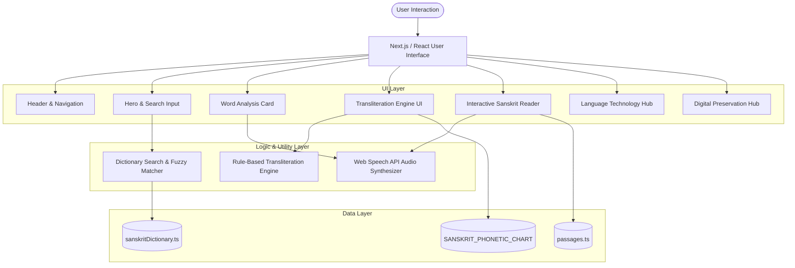

# System Architecture

**Sanskrit Digital Reader** is designed as a modular, client-side, zero-latency linguistic exploration platform. It combines a structured data model with deterministic phonetic utilities and an accessible user interface.

---

## 🏗️ Architectural Overview



---

## 📂 Project Directory Structure

```text
/
├── .npmrc                     # Package manager peer dependency configuration
├── index.html                 # HTML shell with Google Fonts & SEO metadata
├── metadata.json              # Application identification and permissions
├── package.json               # Dependencies and build scripts
├── tsconfig.json              # TypeScript compiler configuration
├── vite.config.ts             # Bundler configuration
├── docs/                      # Complete Markdown documentation suite
│   ├── README.md
│   ├── PROJECT_OVERVIEW.md
│   ├── FEATURES.md
│   ├── INSTALLATION.md
│   ├── USAGE.md
│   ├── ARCHITECTURE.md
│   ├── DICTIONARY.md
│   ├── TRANSLITERATION.md
│   ├── READER.md
│   ├── LANGUAGE_TECHNOLOGY.md
│   ├── DIGITAL_PRESERVATION.md
│   ├── DATA_STRUCTURE.md
│   └── CONTRIBUTING.md
└── src/
    ├── App.tsx                # Main container & state coordinator
    ├── index.css              # Global styles & typography definitions
    ├── main.tsx               # Application entry point
    ├── components/            # Reusable UI components
    │   ├── Header.tsx         # 3-Zone Top Bar navigation
    │   ├── Hero.tsx           # Hero section & sample word triggers
    │   ├── SearchBox.tsx      # Multi-modal search input with auto-suggest
    │   ├── WordAnalysis.tsx   # Detailed morphological inspection card
    │   ├── TransliterationTool.tsx # Bidirectional script converter
    │   ├── SanskritReader.tsx # Interactive word-by-word passage reader
    │   ├── TechnologySection.tsx   # Educational computational linguistics guide
    │   ├── DigitalPreservation.tsx # Manuscript preservation overview
    │   └── Footer.tsx         # Scholarly references & footer links
    ├── data/                  # Static linguistic datasets
    │   ├── sanskritDictionary.ts # Curated 25+ entry Sanskrit lexicon
    │   └── passages.ts        # Tokenized classical literature passages
    └── lib/                   # Core deterministic algorithms
        ├── dictionary.ts      # Search, normalization, & Levenshtein fuzzy ranking
        └── transliteration.ts # Bidirectional Devanagari ⇄ IAST rule engine
```

---

## 🧩 Component Responsibilities

| Component | Responsibility |
| :--- | :--- |
| `App.tsx` | Central state coordinator. Manages the active navigation tab, global search query, selected lexical entry, and filter modes. |
| `Header.tsx` | Top Bar Contract complying with institutional design guidelines: Single-element brand mark, 5 clean text navigation links, and primary action buttons. |
| `Hero.tsx` | Editorial landing banner, multi-modal search input, and quick-access sample chips. |
| `SearchBox.tsx` | Controlled input handling keyboard events, clear actions, and real-time auto-suggest dropdowns. |
| `WordAnalysis.tsx` | Renders the complete linguistic profile for an active headword (root, grammar, Pāṇinian decomposition, literary usage, audio). |
| `TransliterationTool.tsx` | Live conversion interface between Devanagari script and IAST romanization, plus the phonetic articulation taxonomy chart. |
| `SanskritReader.tsx` | Interactive reader rendering tokenized verses where each word triggers a context-aware grammatical breakdown. |
| `TechnologySection.tsx` | Educational guide detailing the 5 pillars of Sanskrit digital language technology and the 5-stage pipeline. |
| `DigitalPreservation.tsx` | Archival essay highlighting manuscript scale, digitization challenges, and TEI XML standards. |

---

## ⚡ Data Flow and State Management

1. **User Search Action**:
   - The user enters a string into `SearchBox` (e.g. `"dharma"` or `"धर्मः"`).
   - `searchDictionary()` normalizes the input using `normalizeIast()`, stripping diacritics to lowercase ASCII.
   - The algorithm evaluates exact Devanagari matches, exact IAST matches, prefix matches, and semantic English definitions.
   - If no direct match is found, Levenshtein distance calculations rank the closest entries in `sanskritDictionary.ts` and return them as suggestions.
2. **Reader Word Inspection**:
   - The user selects a verse in `SanskritReader`.
   - The component iterates through `PassageWordToken[][]`, wrapping each lexical token in an accessible `<button>` element.
   - When clicked, `selectedToken` is updated in local component state, immediately populating the side inspection card.
3. **Transliteration Processing**:
   - The user inputs text into `TransliterationTool`.
   - A `useMemo` hook executes `devanagariToIast()` or `iastToDevanagari()` on each keystroke, achieving instantaneous sub-millisecond conversion.
