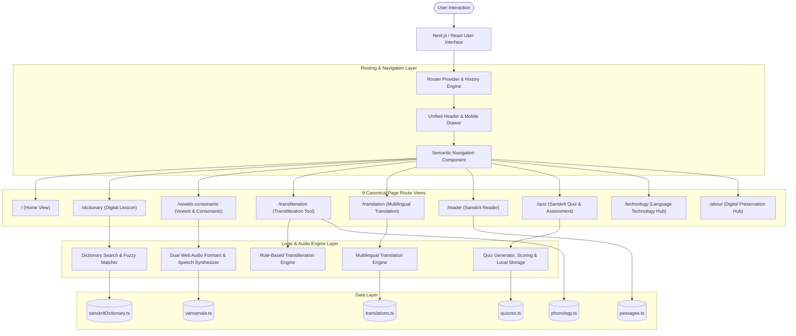

# System Architecture

**Sanskrit Vani** is designed as a modular, client-side, zero-latency linguistic exploration platform with full Next.js App Router-compatible navigation. It combines structured data models with deterministic phonetic utilities, dual-engine audio synthesis, and an accessible user interface.

---

## 🏗️ Architectural Overview



---

## 🗺️ Canonical Route Mapping

| Navigation Label | Canonical URL | Component / View | Active Rule |
| :--- | :--- | :--- | :--- |
| **Home** | `/` | `Hero` + `PlatformOverview` | Exactly `pathname === '/'` |
| **Dictionary** | `/dictionary` | `WordAnalysis` + Lexicon Table | `pathname === '/dictionary'` |
| **Vowels & Consonants** | `/vowels-consonants` | `VowelsConsonantsSection` | `pathname === '/vowels-consonants'` (Aliases: `/varnamala`, `/alphabet`, `/phonetics`) |
| **Transliteration** | `/transliteration` | `TransliterationTool` | `pathname === '/transliteration'` |
| **Translation** | `/translation` | `TranslationTool` | `pathname === '/translation'` |
| **Reader** | `/reader` | `SanskritReader` | `pathname === '/reader'` |
| **Quiz** | `/quiz` | `QuizSection` | `pathname === '/quiz'` |
| **Language Technology** | `/technology` | `TechnologySection` | `pathname === '/technology'` |
| **About** | `/about` | `DigitalPreservation` | `pathname === '/about'` |

---

## 📂 Project Directory Structure

```text
/
├── .npmrc                     # Package manager peer dependency configuration
├── index.html                 # HTML shell with Google Fonts & SEO metadata
├── metadata.json              # Application identification and permissions
├── package.json               # Dependencies, build, test, and dev scripts
├── tsconfig.json              # TypeScript compiler configuration
├── vite.config.ts             # Bundler configuration
├── docs/                      # Complete Markdown documentation suite
│   ├── README.md
│   ├── PROJECT_OVERVIEW.md
│   ├── FEATURES.md
│   ├── VOWELS_CONSONANTS.md   # Detailed phonetics & audio engine docs
│   ├── QUIZ.md                # Detailed quiz & assessment docs
│   ├── INSTALLATION.md
│   ├── USAGE.md
│   ├── ARCHITECTURE.md
│   ├── DICTIONARY.md
│   ├── TRANSLITERATION.md
│   ├── TRANSLATION.md
│   ├── READER.md
│   ├── LANGUAGE_TECHNOLOGY.md
│   ├── DIGITAL_PRESERVATION.md
│   ├── DATA_STRUCTURE.md
│   └── CONTRIBUTING.md
└── src/
    ├── App.tsx                # Main container & 9-route page renderer
    ├── index.css              # Global styles & typography definitions
    ├── main.tsx               # Application entry point
    ├── __tests__/             # Vitest automated test suite
    │   ├── dictionary.test.ts
    │   ├── phonology.test.ts
    │   ├── quiz.test.ts
    │   ├── sandhi.test.ts
    │   ├── sanskrit-analysis.test.ts
    │   ├── sanskrit-processor.test.ts
    │   ├── sanskrit-tokenizer.test.ts
    │   ├── translation.test.ts
    │   └── varnamala.test.ts  # Varṇamālā & audio parameter verification
    ├── components/            # Reusable UI components
    │   ├── Header.tsx         # Universal Top Bar & accessible mobile drawer
    │   ├── Navigation.tsx     # Reusable desktop, mobile, & footer nav items
    │   ├── Hero.tsx           # Hero section & sample word triggers
    │   ├── PlatformOverview.tsx # Feature module overview cards
    │   ├── SearchBox.tsx      # Multi-modal search input with auto-suggest
    │   ├── WordAnalysis.tsx   # Detailed morphological inspection card
    │   ├── VowelsConsonantsSection.tsx # 52-Varṇa audio & visual articulation studio
    │   ├── PhonologicalMap.tsx # Dynamic Sanskrit articulation matrix (उच्चारण-स्थानम्)
    │   ├── TransliterationTool.tsx # Bidirectional script converter
    │   ├── TranslationTool.tsx # Sanskrit → Hindi, Marathi, English translator
    │   ├── TranslationResult.tsx # Translation output & comparative table
    │   ├── LanguageSelector.tsx # Target language switcher
    │   ├── SanskritReader.tsx # Interactive word-by-word passage reader
    │   ├── QuizSection.tsx    # Quiz landing, state management, and orchestration
    │   ├── QuizQuestion.tsx   # Question renderer (single, multiple, true-false, hints)
    │   ├── QuizProgress.tsx   # Real-time progress bar & question counter
    │   ├── QuizResult.tsx     # Score gauge, performance tiers, and review breakdown
    │   ├── TechnologySection.tsx # Educational computational linguistics guide
    │   ├── DigitalPreservation.tsx # Manuscript preservation overview
    │   └── Footer.tsx         # Scholarly references & footer Link navigation
    ├── data/                  # Shared linguistic datasets (Single Source of Truth)
    │   ├── varnamala.ts       # 52 Varṇas, 8 Sthānas, Mātrās, Pāṇinian Sūtras, Audio params
    │   ├── phonology.ts       # Central phoneme & articulation group database
    │   ├── sanskritDictionary.ts # Curated Sanskrit lexicon
    │   ├── translations.ts    # Multilingual translation dataset
    │   ├── passages.ts        # Tokenized classical literature passages
    │   └── quizzes.ts         # 8-category quiz question repository
    └── lib/                   # Core deterministic linguistic algorithms
        ├── router.tsx         # Link, usePathname, useRouter, RouterProvider
        ├── phoneticsAudio.ts  # Web Audio API formant synthesis & SpeechSynthesis engine
        ├── quiz.ts            # Quiz scoring, shuffle, filter, and localStorage history
        ├── sanskrit-context.tsx # Centralized Sanskrit workspace store & state synchronization
        ├── sanskrit-analysis.ts # Shared Sanskrit document model, parser, & in-memory caching
        ├── sanskrit-tokenizer.ts # Multi-line Sanskrit tokenization & inflectional stem heuristics
        ├── sandhi.ts          # Pāṇinian Sandhi segmentation & compound analysis
        ├── phonology.ts       # Real-time phoneme segmentation & articulation analyzer
        ├── dictionary.ts      # Search, normalization, caching, & Levenshtein fuzzy ranking
        ├── transliteration.ts # Bidirectional Devanagari ⇄ IAST rule engine
        └── translation.ts     # Multilingual gloss & sentence matching
```

---

## 🧩 Component Responsibilities

| Component | Responsibility |
| :--- | :--- |
| `router.tsx` | Provides client-side history navigation, `Link` component, `usePathname()`, `useRouter()`, and popstate synchronization without full page reloads. |
| `Navigation.tsx` | Single source of truth for navigation links across Desktop header, Mobile drawer, and Footer. Automatically highlights the active link based on `usePathname()`. |
| `Header.tsx` | Renders the top bar brand mark, desktop navigation, quick search action, and accessible mobile drawer with Escape listener and scroll lock handling. |
| `VowelsConsonantsSection.tsx` | Renders the 52-varṇa alphabet explorer, vocal tract articulation diagrams, Bāraha-khaḍī studio, Pāṇinian Śikṣā verses, and ear training practice. |
| `QuizSection.tsx` | Orchestrates the Sanskrit quiz experience from category/difficulty selection to active question progression and final score evaluation. |
| `App.tsx` | Routes the main viewport to the active route (`/`, `/dictionary`, `/vowels-consonants`, `/transliteration`, `/translation`, `/reader`, `/quiz`, `/technology`, `/about`). |
| `Footer.tsx` | Renders persistent copyright and semantic `Link` items for all routes. |
