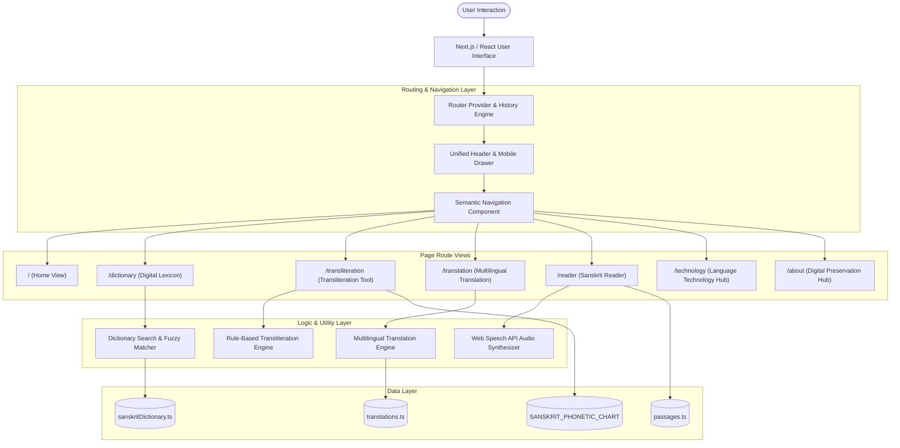

# System Architecture

**Sanskrit Digital Reader** is designed as a modular, client-side, zero-latency linguistic exploration platform with full Next.js App Router-compatible navigation. It combines a structured data model with deterministic phonetic utilities and an accessible user interface.

---

## 🏗️ Architectural Overview



---

## 🗺️ Canonical Route Mapping

| Navigation Label | Canonical URL | Component / View | Active Rule |
| :--- | :--- | :--- | :--- |
| **Home** | `/` | Hero + Interactive Feature Hub | Exactly `pathname === '/'` |
| **Dictionary** | `/dictionary` | `WordAnalysis` + Lexicon Table | `pathname === '/dictionary'` |
| **Transliteration** | `/transliteration` | `TransliterationTool` | `pathname === '/transliteration'` |
| **Translation** | `/translation` | `TranslationTool` | `pathname === '/translation'` |
| **Reader** | `/reader` | `SanskritReader` | `pathname === '/reader'` |
| **Language Technology** | `/technology` | `TechnologySection` | `pathname === '/technology'` |
| **About** | `/about` | `DigitalPreservation` | `pathname === '/about'` |

---

## 📂 Project Directory Structure

```text
/
├── .npmrc                     # Package manager peer dependency configuration
├── index.html                 # HTML shell with Google Fonts & SEO metadata
├── metadata.json              # Application identification and permissions
├── package.json               # Dependencies and build scripts
├── tsconfig.json              # TypeScript compiler configuration
├── vite.config.ts             # Bundler configuration
├── docs/                      # Complete Markdown documentation suite
│   ├── README.md
│   ├── PROJECT_OVERVIEW.md
│   ├── FEATURES.md
│   ├── INSTALLATION.md
│   ├── USAGE.md
│   ├── ARCHITECTURE.md
│   ├── DICTIONARY.md
│   ├── TRANSLITERATION.md
│   ├── TRANSLATION.md
│   ├── READER.md
│   ├── LANGUAGE_TECHNOLOGY.md
│   ├── DIGITAL_PRESERVATION.md
│   ├── DATA_STRUCTURE.md
│   └── CONTRIBUTING.md
└── src/
    ├── App.tsx                # Main container & 7-route page renderer
    ├── index.css              # Global styles & typography definitions
    ├── main.tsx               # Application entry point
    ├── components/            # Reusable UI components
    │   ├── Header.tsx         # Universal Top Bar & accessible mobile drawer
    │   ├── Navigation.tsx     # Reusable desktop, mobile, & footer nav items
    │   ├── Hero.tsx           # Hero section & sample word triggers
    │   ├── SearchBox.tsx      # Multi-modal search input with auto-suggest
    │   ├── WordAnalysis.tsx   # Detailed morphological inspection card
    │   ├── PhonologicalMap.tsx # Dynamic Sanskrit articulation matrix (उच्चारण-स्थानम्)
    │   ├── TransliterationTool.tsx # Bidirectional script converter
    │   ├── TranslationTool.tsx # Sanskrit → Hindi, Marathi, English translator
    │   ├── TranslationResult.tsx # Translation output & comparative table
    │   ├── LanguageSelector.tsx # Target language switcher
    │   ├── SanskritReader.tsx # Interactive word-by-word passage reader
    │   ├── TechnologySection.tsx # Educational computational linguistics guide
    │   ├── DigitalPreservation.tsx # Manuscript preservation overview
    │   └── Footer.tsx         # Scholarly references & footer Link navigation
    ├── data/                  # Shared linguistic datasets (Single Source of Truth)
    │   ├── phonology.ts       # Central phoneme & articulation group database
    │   ├── sanskritDictionary.ts # Curated Sanskrit lexicon
    │   ├── translations.ts    # Multilingual translation dataset
    │   └── passages.ts        # Tokenized classical literature passages
    └── lib/                   # Core deterministic linguistic algorithms
        ├── router.tsx         # Link, usePathname, useRouter, RouterProvider
        ├── phonology.ts       # Real-time phoneme segmentation & articulation analyzer
        ├── dictionary.ts      # Search, normalization, & Levenshtein fuzzy ranking
        ├── transliteration.ts # Bidirectional Devanagari ⇄ IAST rule engine
        └── translation.ts     # Multilingual gloss & sentence matching
```

---

## 🧩 Component Responsibilities

| Component | Responsibility |
| :--- | :--- |
| `router.tsx` | Provides client-side history navigation, `Link` component, `usePathname()`, `useRouter()`, and popstate synchronization without full page reloads. |
| `Navigation.tsx` | Single source of truth for navigation links across Desktop header, Mobile drawer, and Footer. Automatically highlights the active link based on `usePathname()`. |
| `Header.tsx` | Renders the top bar brand mark, desktop navigation, quick search action, and accessible mobile drawer with Escape listener and scroll lock handling. |
| `App.tsx` | Routes the main viewport to the active route (`/`, `/dictionary`, `/transliteration`, `/translation`, `/reader`, `/technology`, `/about`). |
| `Footer.tsx` | Renders persistent copyright and semantic `Link` items for all routes. |
