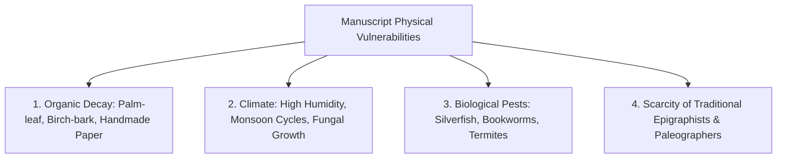

# Digital Preservation of Sanskrit Heritage

This document outlines the scale, vulnerabilities, technological methods, and global imperative for the digital preservation of Sanskrit literature and manuscripts.

---

## 📚 The Scale of Sanskrit Manuscript Heritage

Sanskrit boasts the largest surviving manuscript heritage of any ancient civilization:
- **Estimated Manuscript Volume**: Scholars and archival bodies (such as the National Mission for Manuscripts in India) estimate that between **30 million and 35 million manuscripts** exist worldwide.
- **Geographic Spread**: Manuscripts are conserved across India, Nepal, Tibet, Central Asia, Southeast Asia, and major university libraries across Europe, Japan, and North America.
- **Breadth of Disciplines**: Sanskrit literature encompasses not only philosophy, spirituality, and epic poetry, but also extensive treatises on:
  - **Mathematics (*Gaṇita*)**: Sulba Sūtras, Āryabhaṭa, Brahmagupta, Bhāskara II.
  - **Astronomy (*Jyotiṣa*)**: Sūrya Siddhānta, planetary models.
  - **Medicine & Surgery (*Āyurveda*)**: Caraka Saṃhitā, Suśruta Saṃhitā.
  - **Linguistics & Phonetics (*Vyākaraṇa & Śikṣā*)**: Pāṇini, Patañjali, Bhartṛhari.
  - **Architecture & Metallurgy (*Vāstu & Rasashāstra*)**: Temple engineering, alloys.
- **The Unedited Majority**: Over **90%** of extant manuscripts remain uncataloged, unedited, or unpublished in modern critical editions.

---

## ⏳ Physical Vulnerabilities & The Archival Crisis

Traditional media—such as dried palm leaves (*Tāḷapatra*) and birch bark (*Bhūrjapatra*)—are inherently fragile. Without controlled archival environments, physical manuscripts degrade irreversibly within a few hundred years.

---

## 💻 Digital Preservation Strategies

### 1. High-Resolution Multispectral Imaging
- Preserves raw visual folios before physical degradation destroys the ink.
- **Multispectral Photography**: Uses ultraviolet and infrared light bands to recover faded or erased text on carbon-damaged folios.

### 2. Standardized Machine-Readable Encoding (TEI XML)
- Scanning alone produces only non-searchable image pixels.
- The **Text Encoding Initiative (TEI)** XML standard provides semantic markup for:
  - Critical apparatus variants across different manuscript recensions.
  - Line breaks, foliation, scribe colophons, and marginalia.
  - Named entity recognition (authors, deities, geographical locations).

### 3. Indic Optical Character Recognition (OCR) & Handwriting Recognition (HTR)
- Training deep learning vision models on historical Indic scripts (*Devanagari*, *Grantha*, *Śāradā*, *Newar*).
- Overcoming challenges of conjunct ligature variations and damaged backgrounds.

### 4. Interoperable Lexical Databases & Graph Ontologies
- Connecting digitized texts with formal grammatical engines (like Sanskrit Digital Reader) enables automated indexing, searchability, and instant educational glossaries.

---

## 🌐 Open-Access Preservation Initiatives

Several pioneering global organizations lead the digital Sanskrit conservation effort:
- **National Mission for Manuscripts (NMM, India)**: Documenting and microfilming millions of manuscripts across Indian repositories.
- **Muktabodha Indological Research Institute**: Open-access digital library preserving rare Tantric, Śaiva, and philosophical texts.
- **The Sanskrit Library**: Standardized computational linguistic corpora and lexical resources.
- **GRETIL (Göttingen Register of Electronic Texts in Indian Languages)**: Machine-readable digital corpus for Indological research.
- **SARIT (Search and Retrieval of Indic Texts)**: Standardized TEI-compliant XML repository of philosophical texts.

---

## 🌟 Why Digital Preservation Matters for Future Generations

1. **Democratic Access**: Makes rare texts housed in remote monasteries or private archives instantly accessible to students and researchers worldwide.
2. **Disaster Resilience**: Digital backups safeguard against catastrophic loss from floods, fires, or political unrest.
3. **Cross-Disciplinary Discovery**: Computational search across millions of folios enables historians to reconstruct lost intellectual dialogues, trade routes, and scientific developments.
