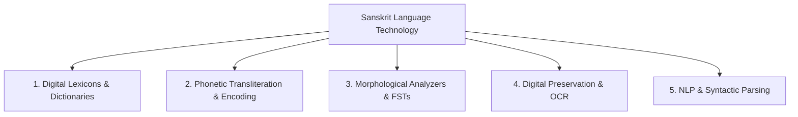

# Sanskrit & Language Technology

This document explores the deep intersection between classical Sanskrit grammatical traditions and modern computational linguistics.

---

## 🏛️ Pāṇini’s *Aṣṭādhyāyī*: The First Formal Generative Grammar

Long before the invention of digital computers or modern formal linguistics (Chomsky, 1956), the ancient Indian grammarian **Pāṇini** (circa 4th century BCE) formalized Sanskrit syntax and morphology in the ***Aṣṭādhyāyī*** ("Eight Chapters").

### Algorithmic Characteristics of Pāṇini's System:
1. **Algebraic Conciseness (3,959 Sūtras)**: A generative rule-set that derives any valid Sanskrit word from basic verbal roots (*dhātus*) and nominal stems (*prātipadikas*).
2. **Auxiliary Markers (*It-saṃjñā*)**: Phonetic tags attached to roots and affixes that act like conditional variables in modern programming to trigger specific phonological rules.
3. **Meta-Rules & Precedence (*Paribhāṣā*)**: Formal rule-ordering algorithms (e.g., *Vipratiṣedhe paraṃ kāryam* — "In case of conflict between two rules of equal force, the subsequent rule prevails").
4. **Precursor to BNF (Backus-Naur Form)**: Computer scientists have noted that Panini's concise generative notation anticipated context-free formal grammars and metalanguages used in compiler design.

---

## 🔬 Core Dimensions of Sanskrit Language Technology

---

### 1. Digital Dictionaries & Lexical Graphs
- **Traditional Precedent**: Synonym thesauri like the *Amarakośa* arranged vocabulary conceptually rather than alphabetically.
- **Modern Implementations**:
  - Digital digitization of 19th/20th-century historical lexicons (Monier-Williams Sanskrit-English Dictionary, V.S. Apte Practical Sanskrit-English Dictionary, Cologne Digital Sanskrit Lexicon).
  - Graph-based wordnets (Sanskrit WordNet) connecting synonymy, antonymy, hypernymy, and *kāraka* relationships.

---

### 2. Standardized Transliteration & Unicode
- **Unicode Standard**: Allocates block `U+0900` through `U+097F` for standard Devanagari script representation.
- **Transliteration Schemes**:
  - **IAST (ISO 15919)**: Human-readable standard for publications with full diacritics.
  - **SLP1 (Sanskrit Library Phonetic Basic Scheme)**: Single-character ASCII encoding designed for high-efficiency computational processing.
  - **ITRANS & Harvard-Kyoto**: Early ASCII schemes designed for standard QWERTY keyboards.

---

### 3. Morphological Analysis & Rule Engines
- **Finite-State Transducers (FSTs)**: Computational models that encode nominal declensions (8 cases × 3 numbers) and verbal paradigms (10 *lakāras* × 3 persons × 3 numbers × 2 voices).
- **Stem-Affix Parsing**: Automated extraction of the base root (*dhātu*), prefixes (*upasargas*), and suffixes (*kṛt*, *taddhita*, *tiṅ*).

---

### 4. Natural Language Processing (NLP) & Computational Challenges

| NLP Task | Description | Computational Complexity |
| :--- | :--- | :--- |
| **Sandhi Splitting (*Padaccheda*)** | Segmenting phonologically merged word boundaries (e.g. `कर्मण्येवाधिकारस्ते` → `कर्मणि + एव + अधिकारः + ते`). | Highly ambiguous; multiple valid splits must be filtered via semantic context. |
| **Compound Deconstruction (*Samāsa Vigraha*)** | Decomposing long noun compounds into constituent words and identifying internal relations (*Tatpuruṣa*, *Bahuvrīhi*, *Dvandva*). | Exponential combination paths in multi-word compounds. |
| **Dependency Parsing (*Kāraka Analysis*)** | Mapping thematic case roles (agent, patient, instrument, locus) to analyze non-fixed word order sentences. | Free word-order syntax requires semantic constraint satisfaction. |

---

## ⚖️ Implementation Scope of This Application

| Feature | Implemented in Sanskrit Digital Reader | Scope of Enterprise / Research Systems |
| :--- | :---: | :---: |
| **Lexicon Lookup** | ✅ Curated baseline dataset | Full million-entry historical corpora |
| **Transliteration** | ✅ Real-time bidirectional Devanagari ⇄ IAST | Complex Vedic accent parsing & multi-script conversion |
| **Reader Tokenization** | ✅ Pre-annotated, verified classical verses | Automated AI Sandhi segmentation for unedited texts |
| **Grammatical Display** | ✅ Pāṇinian decomposition & case markers | Full generative FST word derivation engine |
