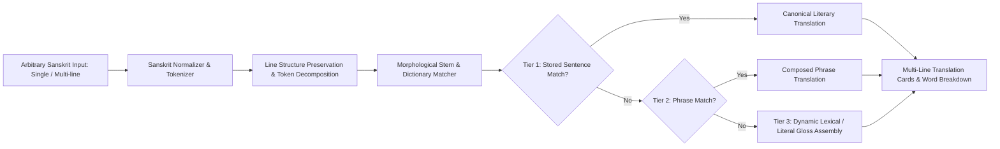

# Sanskrit Multilingual Translation Module

The **Translation Module** enables cross-lingual access to classical and contemporary Sanskrit literature by providing structured translations from **Sanskrit into Hindi, Marathi, and English**.

---

## 🌐 Supported Languages

| Source Language | Target Language | Script / System | Example Output |
| :--- | :--- | :--- | :--- |
| **Sanskrit (संस्कृतम्)** | **Hindi (हिन्दी)** | Devanagari | `विद्या विनय प्रदान करती है और विनय से योग्यता प्राप्त होती है।` |
| **Sanskrit (संस्कृतम्)** | **Marathi (मराठी)** | Devanagari | `विद्या विनय देते आणि विनयामुळे मनुष्य पात्रता प्राप्त करतो.` |
| **Sanskrit (संस्कृतम्)** | **English** | Latin (English) | `Knowledge gives humility, and from humility one attains worthiness.` |

---

## 🔄 Translation Architecture & Workflow



---

## 🗄️ Local Translation Dataset Structure

Located in `src/data/translations.ts`.

```typescript
export interface SanskritTranslationEntry {
  id: string;               // Unique slug (e.g. 'vidya-dadati-full')
  sanskrit: string;         // Canonical Sanskrit text
  iast: string;             // IAST transliteration
  hindi: string;            // Hindi translation
  marathi: string;          // Marathi translation
  english: string;          // English translation
  type: 'word' | 'phrase' | 'sentence';
  category?: string;        // Literary/philosophical context
  context?: string;         // Commentary or grammatical notes
}
```

### Representative Sample Records:

#### 1. Core Word Translation:
```typescript
{
  id: 'dharmah',
  sanskrit: 'धर्मः',
  iast: 'dharmaḥ',
  hindi: 'धर्म, कर्तव्य, सदाचार, नैतिक व्यवस्था, स्वाभाविक गुण',
  marathi: 'धर्म, कर्तव्य, सदाचार, नीतीमत्ता, नैतिक व्यवस्था',
  english: 'Dharma, righteousness, duty, moral order, intrinsic nature',
  type: 'word',
  category: 'Ethics & Philosophy'
}
```

#### 2. Complete Verse / Sentence Translation:
```typescript
{
  id: 'vidya-dadati-full',
  sanskrit: 'विद्या ददाति विनयं विनयाद् याति पात्रताम् । पात्रत्वाद् धनमाप्नोति धनाद् धर्मं ततः सुखम् ॥',
  iast: 'vidyā dadāti vinayaṃ vinayād yāti pātratām | pātratvād dhanamāpnoti dhanād dharmaṃ tataḥ sukham ||',
  hindi: 'विद्या विनय प्रदान करती है, विनय से मनुष्य योग्यता प्राप्त करता है, योग्यता से धन प्राप्त होता है, धन से धर्म का आचरण होता है और धर्म से सच्चा सुख मिलता है।',
  marathi: 'विद्या विनय देते, विनयामुळे मनुष्य पात्रता प्राप्त करतो, पात्रतेमुळे धन मिळते, धनातून धर्माचे आचरण होते आणि त्यातून चिरंतन सुख मिळते.',
  english: 'Knowledge gives humility; from humility one attains worthiness; from worthiness one acquires wealth; from wealth one performs righteous duty (dharma), and from that arises true happiness.',
  type: 'sentence',
  category: 'Hitopadeśa (Subhāṣitam)',
  context: 'The progressive ethical and psychological chain of human flourishing.'
}
```

---

## 🧩 Word-Level Translation

When viewing any entry in the **Dictionary** or clicking a word in the **Reader**, the interface provides parallel Hindi, Marathi, and English definitions:

```text
+-------------------------------------------------------------------------------+
|  Sanskrit:  धर्मः                                                             |
|  IAST:      dharmaḥ                                                           |
|  English:   Righteousness, duty, moral order, intrinsic nature                |
|  Hindi:     धर्म, कर्तव्य, सदाचार, नैतिक व्यवस्था                             |
|  Marathi:   धर्म, कर्तव्य, सदाचार, नीतीमत्ता, नैतिक व्यवस्था                  |
+-------------------------------------------------------------------------------+
```

---

## 📜 Reader Integration

In the **Sanskrit Reader**:
1. Readers select a classical verse (*Hitopadeśa*, *Bhagavad Gītā 2.47*, *Upaniṣad*).
2. The language selector allows instant switching between:
   - `[ Hindi (हिन्दी) | Marathi (मराठी) | English ]`
3. The verse-level translation and the side word inspection card update dynamically to display definitions in the chosen target language without resetting the passage selection state.

---

## 🤖 Sanskrit Machine Translation: Challenges & Future Scope

Translating Sanskrit into modern languages involves several non-trivial computational linguistics tasks:

1. **Sandhi Splitting (*Padaccheda*)**: Fused word boundaries must be phonologically split before morphological analysis.
2. **Inflection & Agreement**: Sanskrit verbs encode subject person/number directly, while Hindi and Marathi verbs mark grammatical gender and ergative case (*ne* / *ni* markers).
3. **Free Word Order to SOV/SVO**: Sanskrit poetry has non-fixed word order, requiring syntactic dependency tree parsing (*Kāraka*) before target sentence generation.
4. **Polysemy & Word Sense Disambiguation**: Words like *Dharma*, *Brahma*, *Sat*, or *Māyā* require contextual semantic modeling.

---

## ⚠️ Educational Scope & Disclaimer

This module is an **educational demonstration** powered by a deterministic, verified multilingual dataset and tokenized glossing logic. It does not claim to be an unconstrained black-box neural machine translation engine.
